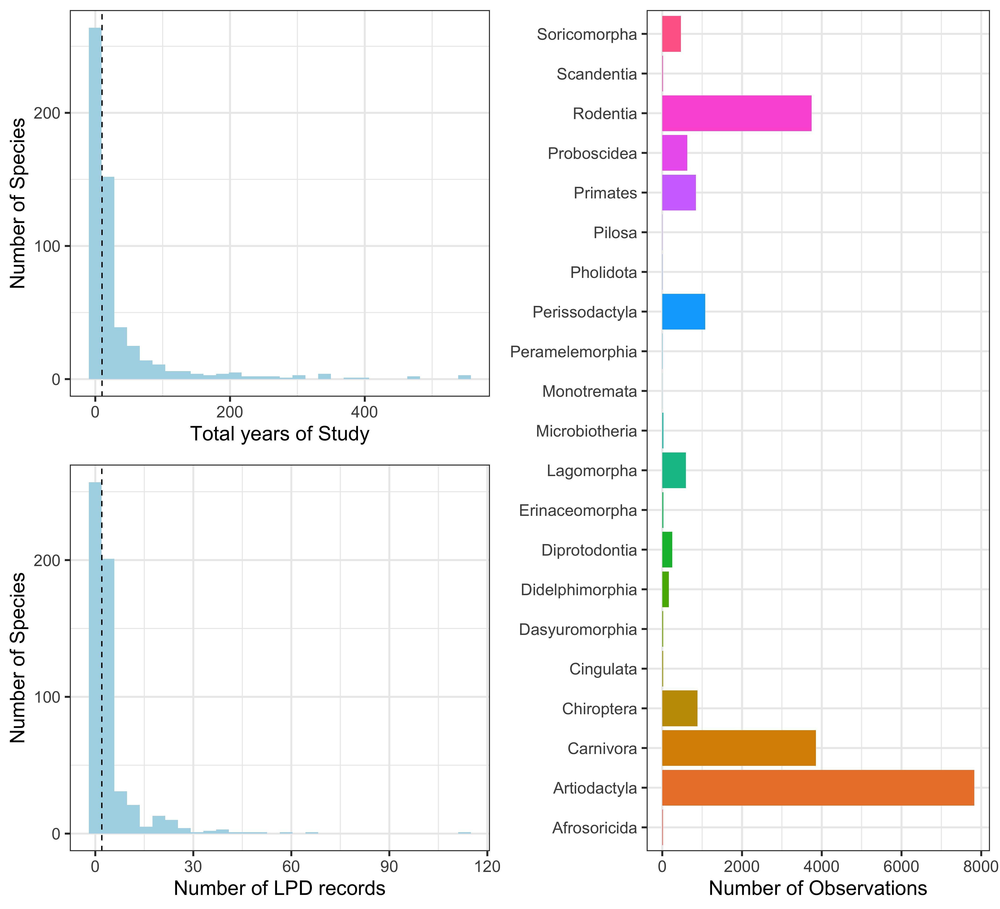
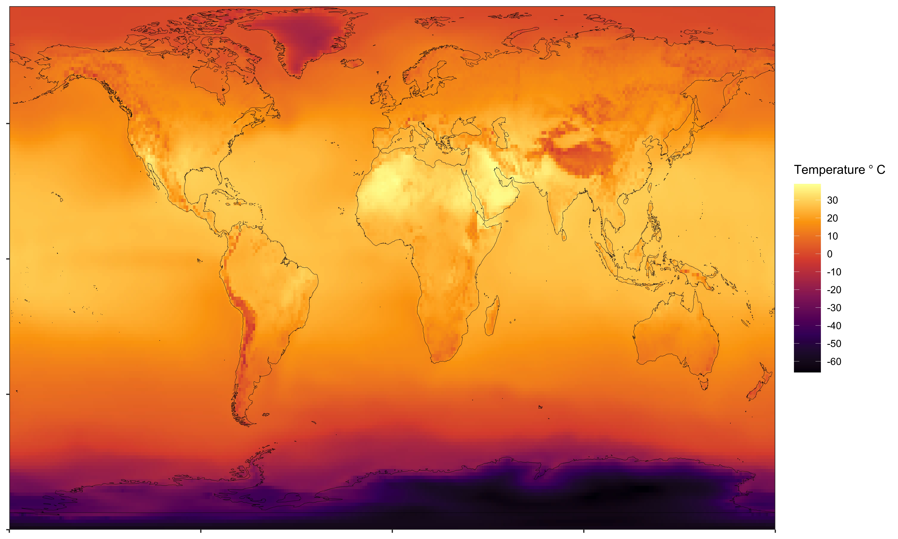
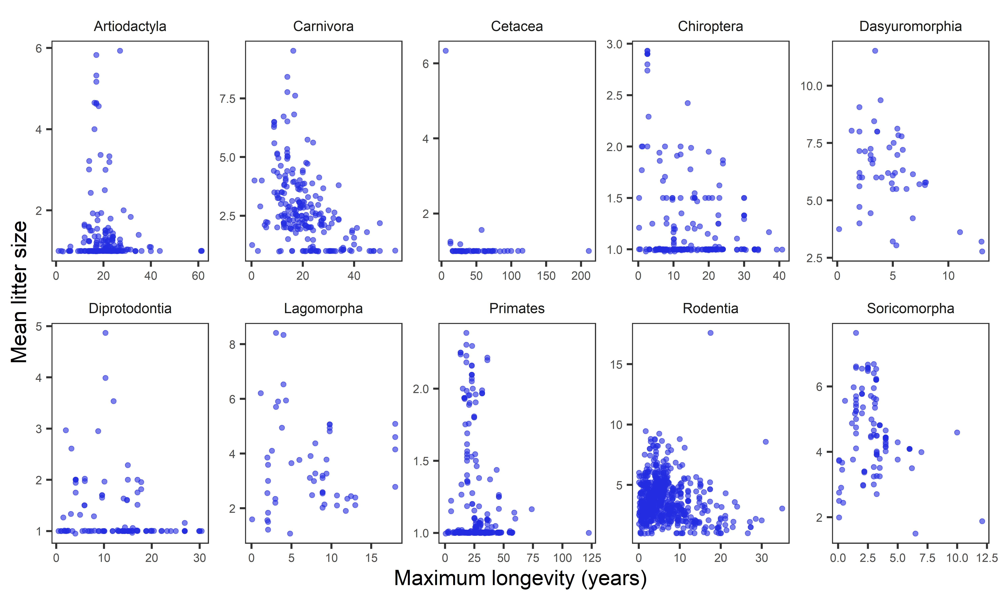
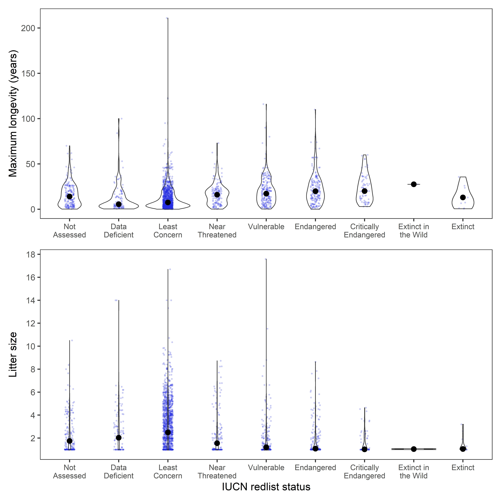

# Analysis for 
# _Life-history predicts global population responses to the weather in the terrestrial mammals_
# Jackson, J., Le Coeur, C. and Jones, O.R

#### 2021-03-16
#### Repository created by John Jackson

---

Full analysis and code for our study on terrestrial mammals to investigate how weather influences annual changes in abundance and how this is linked to species-level life-history traits. For the manuscript please see <link to bioarkiv/paper>.

The analysis is split into the following 5 sections. Sections 2-5 are associated with a specific directory and their own `README.md` file, so see those for more details:

1. **Exploring** raw data for mammal abundance, weather, phylogeny, and life-history (explored here).
2. Extracting salient `weather_variables/` from the weather data.
3. Managing mammal data on `annual_abundance_changes/` and calculating annual population growth rates.
4. Linking `weather_population_growth/` to asses weather effects on population change for each record.
5. `meta_regression/` to explore comparative patterns in weather effects across the mammals.

In this README, we will walk through section 1: the exploration of the raw data used in the study, which is performed in `chelsa_exploration.R`, `mam_exploration.R`, `phylo_exploration.R` and `dski_exploration` in the root of the repository here. 

---

We are making use of:

1. The Living Planet Database of vertebrate abundance timeseries, which can be downloaded at [The Living Planet Index website](https://livingplanetindex.org/home/index).
2. The CHELSA Climatologies at high resolution for the earth’s land surface areas 1979-2013, which can be downloaded from [Karger et al. (2017)](https://www.nature.com/articles/sdata2017122).
3. The recently updated phylogenetic tree for the mammals, which can be downloaded from [Upham et al. 2019](https://doi.org/10.1371/journal.pbio.3000494).
4. Life-history information from the Demographic Species Knowledge Index compendium from [Conde et al. 2019](https://doi.org/10.1073/pnas.1816367116).

---

## 1. Living Planet Database for terrestrial mammals `mam`

The Living Planet Index is a key indicator of the state of global biodiversity, monitoring trends in vertebrate popualtions over many decades. Developed by the Zoological Society of London (ZSL) and the World Wildlife Fund (WWF), this index has been a crucial indicator for international policy on conservation. Here, we are using the data that underpins the LPI, which is also maintained by ZSL and the WWF. We are restricting to only include data from the terrestrial mammals for ease of processing and interpretation at this stage. According to the Living Planet Index website: 

> *The Living Planet Database (LPD) currently holds time-series data for over 20,000 populations of more than 4,200 mammal, bird, fish, reptile and amphibian species from around the world, which are gathered from a variety of sources such as journals, online databases and government reports. Using a method developed by ZSL and WWF, these species population trends are aggregated to produce indices of the state of biodiversity. The rest of our work focuses on expanding the coverage of LPI data to more broadly represent vertebrate biodiversity from all around the globe and disaggregating the index to measure trends in different thematic areas. This includes assessing the changes in different taxonomic groups, looking at species trends at a national or regional level, identifying how different threats affect populations and providing an insight into how conservation intervention can promote species recoveries.*

Access to the LPD can be obtained at https://livingplanetindex.org/home/index. 

---

Some general features of the raw data for terrestrial mammals used in this study


There is variation in the number of observations over time and in the number of years for each record


Crucially, each record comes with a set of coordinates for the study's location. This will allow us to link changes in vertebrate abundance to changes in weather variables globally. This is not always in reference to a specific population location, but instead gives the user a general idea about the locality of the abundance record.


As can be seen in the colours of the points in the map above, there is also lots of variation in the number of records and the length of study between the different taxonomic groups within the class Mammalia. There is particular variation between the orders of mammals, and at the species level.



The key feature of the Living Planet Database is the monitoring of annual abundance. Abundance here is characterised in several ways. To name a few examples, there can be estimates of density, monitoring per unit effort, indices or full population counts. In the first plot below you can see the number of observations for these broad categories of abundance measure. We will explore the differences in these different measures of abundance later in the study. 

To make studies comparable, we have ln transformed the abundance for each of the records. The second plot just presents overall smoothed changes in abundance on the log scale for each order. Drawing conclusions from these patterns is is ofcourse unadvisable, but instead just a way of visualising what the data looks like.


---

## 2. CHELSA

The data from CHELSA is in the form of raster files (`.tif`), which can be downloaded from [here](http://chelsa-climate.org/downloads/). The rasters are at a spatial resolution of 30 arc sec, which is approximately 1 kilometer squared, and records are between 1979-2013. Thus, there is data for over 900 million raster cells. There are several monthly/annual timeseries measures of temperature and precipitation. Here we focus on monthly mean temperature and total precipitation from CHELSA `version 1.2.1`.

The CHELSA raster files for mean monthly temperature and total precipitation were accessed with bash scripts that took the general form:

```
#!/usr/bin/env bash 
wget https://www.wsl.ch/lud/chelsa/data/timeseries/tmean/CHELSA_tmean_1979_01_V1.2.1.tif
wget https://www.wsl.ch/lud/chelsa/data/timeseries/prec/CHELSA_prec_1979_01_V1.2.1.tif
```

Full bash scripts can be accessed from https://github.com/jonesor/compadre-climate. Below is an example of the mean temperature and total precipitation in August 1993 for each of the 30 arc sec grid cells.


 

---

## 3. The mammal phylogeny

The mammal phylogeny used in the current study is from the following paper:

Upham, N. S., Esselstyn, J. A., and Jetz, W. 2019. Inferring the mammal tree: species-level sets of phylogenies for questions in ecology, evolution, and conservation. PLOS Biology. [https://doi.org/10.1371/journal.pbio.3000494](https://doi.org/10.1371/journal.pbio.3000494)

Here, the authors apply a 'backbone-and-patch' approach to a newly assembled 31-gene supermatrix and Bayesian inference to give credible sets of phylogenetic trees. Here we use the **maximum clade credibility tree**, which can be downloaded directly from [here](https://doi.org/10.5061/dryad.tb03d03). The maximum clade credibility tree used in this study is in the following data file:

> `MamPhy_fullPosterior_BDvr_Completed_5911sp_topoCons_NDexp_MCC_v2_target.tre`

Species names were first matched against the species names from the [Catalogue of Life](http://www.catalogueoflife.org/) and the mammal tree pruned to include only species present in the Living Planet Database. This left **538** species from the original mammal phylogeny. This phylogenetic tree was used in all subsequent phylogenetic regressions, and is presented below


---

## 4. Life-history data

Here we are using species-level life-history data as predictors of responses to the weather. The data used in this study is from the following two publications:

Conde, D. A., Staerk, J., Colchero, F., da Silva, R., Schöley, J., Baden, H. M., *et al.* 2019. Data gaps and opportunities for comparative and conservation biology. Proceedings of the National Academy of Sciences. [https://doi.org/10.1073/pnas.1816367116](https://doi.org/10.1073/pnas.1816367116)

Myhrvold, N.P., Baldridge, E., Chan, B., Sivam, D., Freeman, D.L. and Ernest, S.M., 2015. An amniote life‐history database to perform comparative analyses with birds, mammals, and reptiles: Ecological Archives E096‐269. Ecology. [https://esajournals.onlinelibrary.wiley.com/doi/abs/10.1890/15-0846R.1](https://esajournals.onlinelibrary.wiley.com/doi/abs/10.1890/15-0846R.1)

In the first, the authors classify the availability of demographic information for >31,000 (97%) extant tetrapod species. This is the Demographic Species Knowlege Index (referred to as `dski` here). This study involved aggregating and centralising life-history information for all species possible, spanning data from 22 available data repositories. The full aggregated dataset can be found on [Dryad](https://doi.org/10.5061/dryad.nq02fm3).

The second is the Amniote Life-History Database (referred to as `alhd` here), which is a large single repository for life-history data from the amniotes, which can be downloaded from [here](https://datarepository.wolframcloud.com/resources/Amniote-Life-History-Database).

For the purpose of this study, we are interested in how key characteristics of the life-history of a species may influence their ability to withstand local changes in the weather. Generally, longer lived species with 'slow' life-history characteristics are expected to display weaker responses to changes in their environment. Here we use three commonly available  traits that generally typify life-history: longevity, litter size and body size. 

For longevity and litter size, we use comparable metrics of these two demographic traits from several data repositories. The three sources for this information were the [Amniote Life-History Database](https://datarepository.wolframcloud.com/resources/Amniote-Life-History-Database), [PanTHERIA](http://esapubs.org/archive/ecol/E090/184/) and [AnAge](https://www.genomics.senescence.info/species/). For the body size data, we use only the Amniote Life-History Database.

We present species-level data aggregated and summarised from the databases below and in `lifehistory_exploration.R`. Our key traits of interest are **Maximum Longevity**, **Litter Size** and **Adult bodymass**. Where multiple records were available for a single species, we calculated the maximum of the maximum longevity values, and the mean of litter size/adult bodymass.

> We used natural log and z-transformed variables for **Maximum Longevity**, **Litter Size** and **Adult bodymass** in all subsequent analyses.

Across the mammals, there is an interesting pattern between maximum longevity and litter size, with the apparent presence of an upper limit or trade-off between the size of the litter size and maximum longevity:


We can also see this for different orders of the mammals, here presented for any order with over 40 species represented with data. The majority of data is from the rodents for example, where the same triangular pattern can be observed.



Also stored in the Demographic Species Knowledge Index is species-level information on conservation status from the IUCN redlist. Here we have the threat status of all species in the data-set. This threat status can be an indication of recent and rapid population decline, and thus we also expect that there may be patterns between life-history traits and threat status. Here we can see the distribution of maximum longevity and litter size based on the IUCN redlist status. There are some slight indications that longer living species that produce fewer offspring tend to be a higher threat status. 



For allometric patterns of bodymass, we see a clear general positive relationship between body size and maximum longevity. Bigger bodied mammals live for longer. However, the relationship between litter size and bodymass is less clear. We do expect that most very large organisms to have small litters though on average. Here are these relationships for the scaled, ln-transformed variables.


Now, in the current study, we want to relate these life-history traits to observed population responses to the weather.


