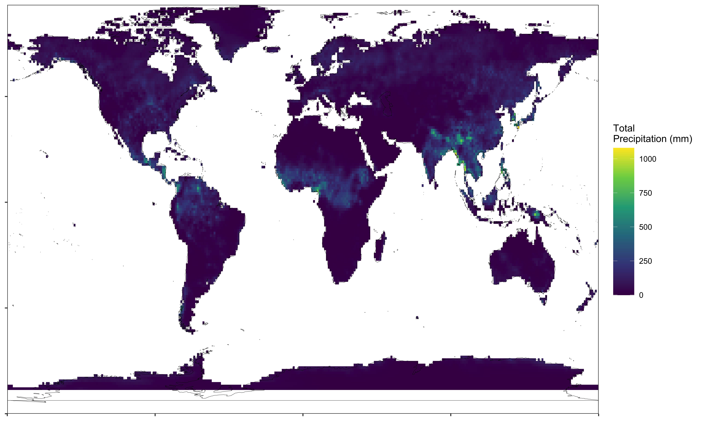
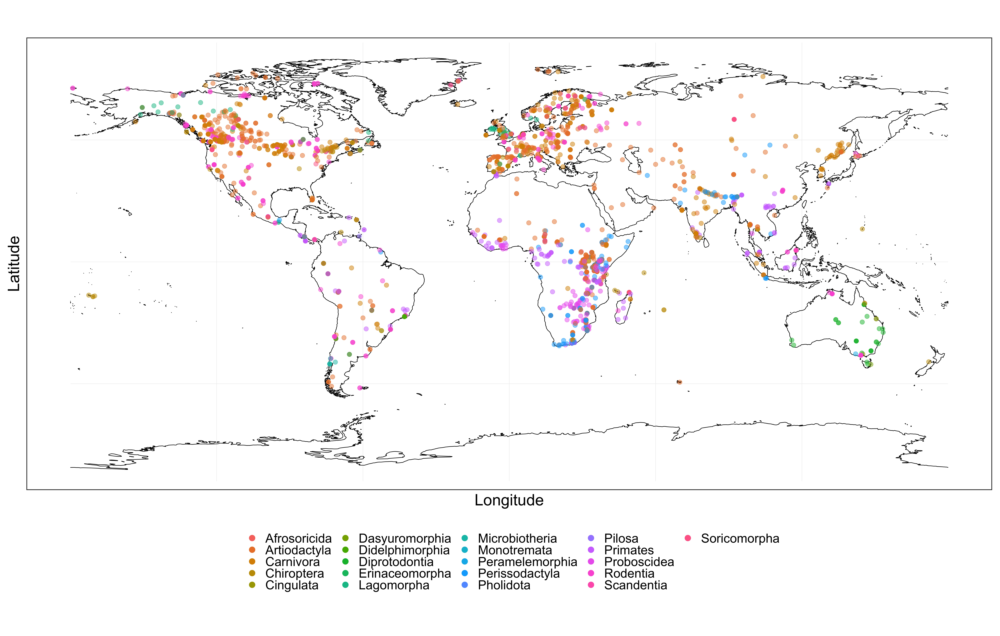

# Pilot study: Global weather and changes in vertebrate abundance

---

Pilot study on terrestrial mammals to investigate how weather influences annual changes in abundance.

Here we are making use of:

1. The Living Planet Database of vertebrate abundance timeseries, which can be found at https://livingplanetindex.org/home/index.
2. The CHELSA Climatologies at high resolution for the earth’s land surface areas 1979-2013, which is from [Karger et al. (2017)](https://www.nature.com/articles/sdata2017122).

---

The analysis is split into the following sections:

1. Exploring raw data from CHELSA and the Living Planet Database.
2. Extracting data from CHELSA for the localities of the Living Planet studies.
3. Salient local weather variables from the CHELSA data.
4. Detrending annual abundance data to focus on annual changes excluding underlying trends.
5. ...

Here, we will walk through the exploration of the raw data used in the study, which is performed in `chelsa_exploration.R` and `mam_exploration.R`. The rest of the sections can be found in separate directories.

---

### CHELSA

The data from CHELSA is in the form of raster files (`.tif`), which can be downloaded from [here](http://chelsa-climate.org/downloads/). The rasters are at a spatial resolution of 30 arc sec, which is approximately 1 km$^2$, and records are between 1979-2013. Thus, there is data for over 900 million raster cells. There are several monthly/annual timeseries measures of temperature and precipitation. Here we focus on monthly mean temperature and total precipitation from CHELSA `version 1.2.1`.

The CHELSA raster files for mean monthly temperature and total precipitation were accessed with bash scripts that took the general form:

```
#!/usr/bin/env bash 
wget https://www.wsl.ch/lud/chelsa/data/timeseries/tmean/CHELSA_tmean_1979_01_V1.2.1.tif
wget https://www.wsl.ch/lud/chelsa/data/timeseries/prec/CHELSA_prec_1979_01_V1.2.1.tif
```

Full bash scripts can be accessed from https://github.com/jonesor/compadre-climate. Below is an example of the mean temperature and total precipitation in August 1993 for each of the 30 arc sec grid cells.




---

### Living Planet Database for terrestrial mammals `mam`

The Living Planet Index is a key indicator of the state of global biodiversity, monitoring trends in vertebrate popualtions over many decades. Developed by the Zoological Society of London (ZSL) and the World Wildlife Fund (WWF), this index has been a crucial indicator for international policy on conservation. Here, we are using the data that underpins the LPI, which is also maintained by ZSL and the WWF. We are restricting to only include data from the terrestrial mammals for ease of processing and interpretation at this stage. According to the Living Planet Index website: 

> *The Living Planet Database (LPD) currently holds time-series data for over 20,000 populations of more than 4,200 mammal, bird, fish, reptile and amphibian species from around the world, which are gathered from a variety of sources such as journals, online databases and government reports. Using a method developed by ZSL and WWF, these species population trends are aggregated to produce indices of the state of biodiversity. The rest of our work focusses on expanding the coverage of LPI data to more broadly represent vertebrate biodiversity from all around the globe and disaggregating the index to measure trends in different thematic areas. This includes assessing the changes in different taxonomic groups, looking at species trends at a national or regional level, identifying how different threats affect populations and providing an insight into how conservation intervention can promote species recoveries.*

Access to the LPD can be obtained at https://livingplanetindex.org/home/index. 

---

Some general features of the raw data for terrestrial mammals used in this study


There is variation in the number of observations over time and in the number of years for each record


Crucially, each record comes with a set of coordinate for the studies location. This will allow us to link changes in vertebrate abundance to changes in weather variables globally. This is not always in reference to a specific population location, but instead gives the user a general idea about the locality of the abundance record.



As can be seen in the colours of the points in the map above, there is also lots of variation in the number of records and the length of study between the different taxonomic groups within the class Mammalia. There is particular variation between the orders of mammals, and at the species level.


The key feature of the Living Planet Database is the monitoring of annual abundance. Abundance here is characterised in several ways. To name a few examples, there can be estimates of density, monitoring per unit effort, indices or full population counts. We will explore the differences in these different measures of abundance later in the study, but for now, we have z-transformed the abundance for each of the records and just present overall smoothed changes in relative abundance for each order. Drawing conclusions from these patterns is is ofcourse unadvisable, but instead just a way of visualising the changes in abundance over each of the groups.


---
